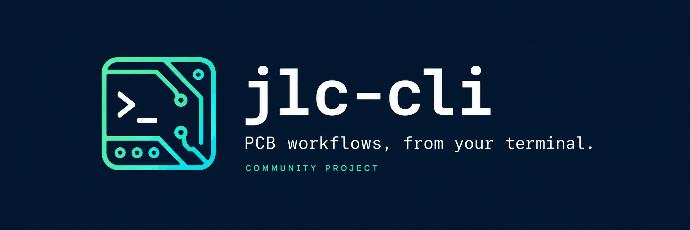
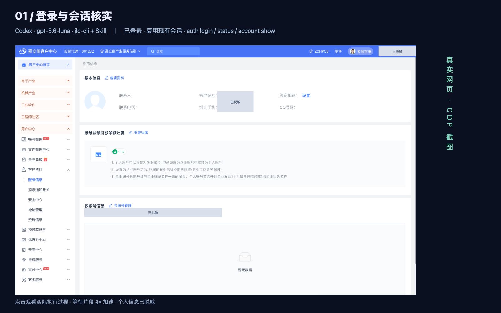
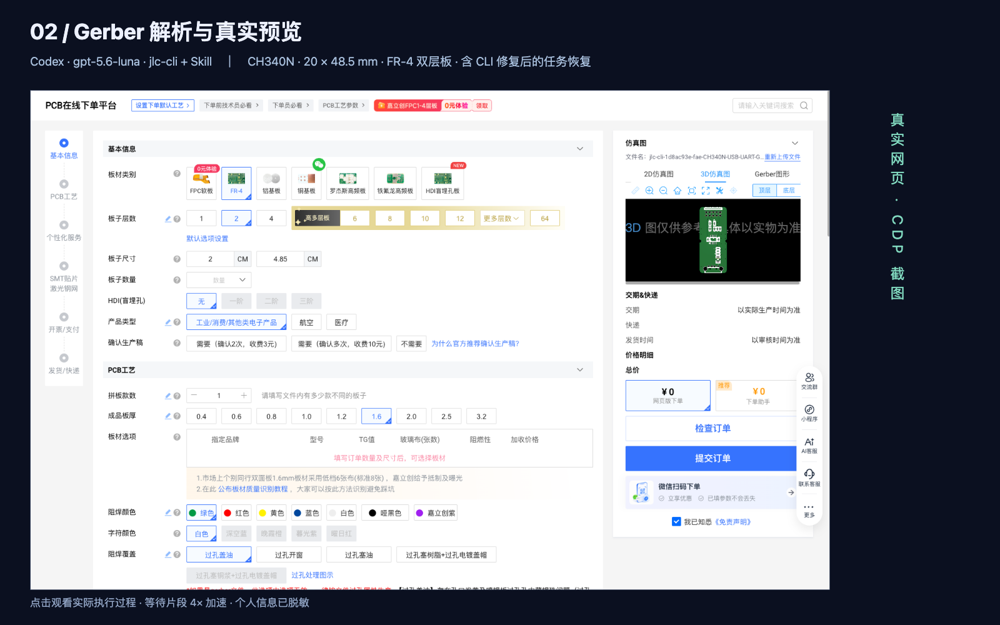
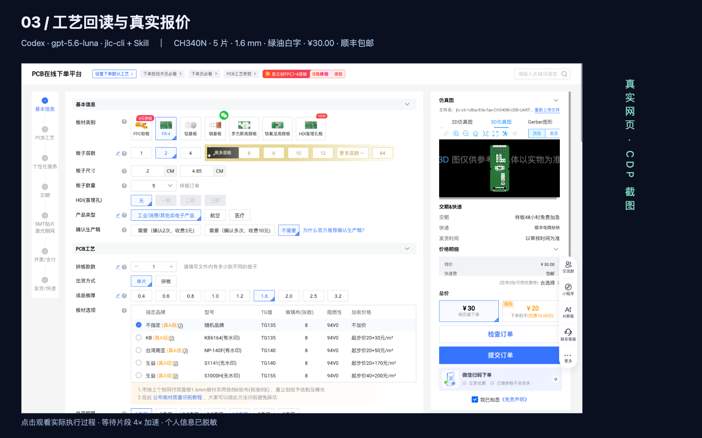
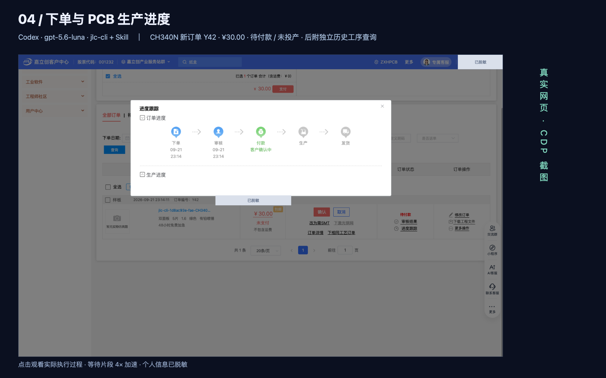
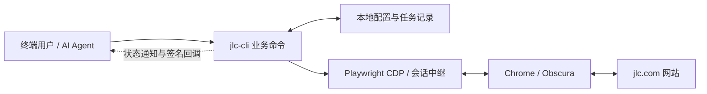

<p align="center">
  
</p>

<h1 align="center">jlc-cli</h1>

<p align="center"><strong>非官方社区项目 · Unofficial community project</strong><br>与嘉立创官方无隶属关系，未经官方背书。</p>

<p align="center">
  <a href="https://github.com/TXyy2023/jlc-cli/actions/workflows/ci.yml"></a>
  <a href="package.json"></a>
  <a href="package-lock.json"></a>
  <a href="package.json"></a>
  <a href="package-lock.json"></a>
  <a href="LICENSE"></a>
</p>

<p align="center">
  <strong>让终端与 AI Agent 操作真实的 PCB 业务流程。</strong><br>
  <a href="#视频演示">视频演示</a> · <a href="#快速开始">快速开始</a> · <a href="skills/jlc-cli/SKILL.md">Agent Skill</a> · <a href="docs/acceptance.md">验收范围</a> · <a href="docs/design.md">设计说明</a>
</p>

把嘉立创中国站的常用业务流程接入终端与 AI Agent：登录、上传 PCB 文件、读取和设置工艺参数、预览、报价，以及查询已有订单。

**这是一个非官方、社区维护的开源参考项目，不是嘉立创官方插件，也没有嘉立创官方背书。** 项目面向 [嘉立创中国站 jlc.com](https://www.jlc.com/)，通过浏览器操作网站，不代表官方开放 API；海外 JLCPCB 的账号、接口和业务规则不属于本项目范围。

当前版本为 **`1.0.0-dev.4`**，尚未发布到 npm，请从源码构建。建议先阅读下面的能力范围，再用自己的测试文件完成一次“上传 → 参数 → 报价”，熟悉结果后接入日常工作流。

## 视频演示

以下录像使用 `jlc-cli` 命令；历史执行结果和素材保持原样。

使用 Codex 的 **`gpt-5.6-luna`**，搭配本项目 CLI 与 Skill，演示“自然语言指令 → AI 实际执行（等待片段 4× 加速）→ 通过 CDP 连接对应网页截图”。点击封面打开视频；也可下载仓库后打开 [四格播放器](docs/media/demos/index.html)。画面录制自实时显示的 Codex CLI 事件流，素材来源与验证边界见 [录制说明](docs/media/demos/SOURCE.md)，进度见 [制作清单](docs/demo-videos.md)。

<table>
  <tr>
    <td width="50%"><strong>① 登录与会话核实</strong><br><a href="docs/media/demos/01-login.mp4"></a><br>复用已登录会话并核实账号；本次没有重新扫码。</td>
    <td width="50%"><strong>② Gerber 解析与预览</strong><br><a href="docs/media/demos/02-preview.mp4"></a><br>开源 CH340N 双层板；包含遇到加载问题、修复 CLI 后继续同一任务成功预览的过程。</td>
  </tr>
  <tr>
    <td width="50%"><strong>③ 报价</strong><br><a href="docs/media/demos/03-quote.mp4"></a><br>5 片实际报价 30.00 元、顺丰包邮；本段从客编弹窗接管完成后开始。</td>
    <td width="50%"><strong>④ 下单与 PCB 生产进度</strong><br><a href="docs/media/demos/04-orders.mp4"></a><br>新订单 Y42 已核实，30 元待付款、未投产；另附明确标注的历史订单 Y40 工序查询。</td>
  </tr>
</table>

## 可以用它做什么

对终端用户，`jlc-cli` 把分散在网页里的操作整理成可组合的命令。对 AI Agent，它提供结构化结果、持久化任务和配套 Skill，让 Agent 能围绕用户的文件与约束推进流程，并在缺少决定、需要登录或遇到页面异常时明确停在哪一步。

例如，你可以让 Agent 上传一份指定的 Gerber 压缩包，列出当前可选工艺，按你确认的参数获取预览和报价；也可以直接在终端查询已有 PCB 订单的详情与生产进度。CLI 本身不内置大模型，参数建议和自然语言沟通由你使用的 Agent 完成。

| 能力 | 当前状态 |
| --- | --- |
| 登录与账号 | Chrome 已验证微信快捷登录、身份核实、真实二维码素材交付、签名登录回调及会话恢复；不代表所有登录方式均已验证 |
| PCB 文件到报价 | Chrome 已验证合成 Gerber 测试板的上传解析、参数设置与回读、网站实际预览和报价；其他工艺组合仍需补充验证 |
| 已有订单查询 | 已验证现有 PCB 订单的列表、详情和进度；官网 PCB/FPC 共用列表中的 FPC 字段差异尚未验收 |
| 建单 | 已实际建立 CH340N 订单并按唯一文件名查询核实；提交任务仍返回 unknown，当前需独立只读核验，见演示说明 |
| 余额付款、嘉小智文本对话 | 尚未完成真实业务的完整验收；本次付款准备停在订单绑定检查，未扣款 |
| Agent 集成与异常恢复 | 提供 JSON/事件输出、任务观察、保留页面和 CDP 接管；真实业务接管闭环仍需继续验证 |

**当前实站使用请显式选择 Chrome。** 默认引擎仍为 [Obscura](https://github.com/h4ckf0r0day/obscura)，其运行时与公开页面访问已验证，但客户中心及登录页面的兼容问题尚未解决。CLI 不会自动切换引擎。macOS、Windows、Linux 已有自动化检查基线，具体浏览器与业务验证范围见 [验收记录](docs/acceptance.md)。

## 如何实现

项目使用 **TypeScript + Playwright CDP**。CLI 将业务命令交给站点适配器，由适配器读取当前页面、执行操作并核实结果；文件解析、工艺计价、建单和支付仍由嘉立创网站完成。



本地中继在命令之间保留浏览器连接和页面，任务记录关联账号配置、文件、参数与结果。这样一次命令结束后，后续操作仍能沿用原页面；出现异常时，也能把对应页面交给人类或 Agent 处理。它不依靠每一步重新打开网站来恢复上下文。

业务结果有明确状态：成功、缺少输入、需要登录、需要确认、待接管或结果未知。调用方可以读取最终 JSON，也可以消费逐行 JSON 事件；需要异步通知时，可显式配置回调并使用 HMAC 签名校验。回调投递失败与业务失败分别处理，重投通知不会重做登录或订单操作。

这是基于网站页面的集成，网站改版、条件字段变化和会话过期都可能影响适配。项目通过回读实际值、保存任务和报告差异来暴露这些变化。更多责任划分与恢复规则见 [设计说明](docs/design.md) 和 [浏览器说明](docs/browser.md)。

## 快速开始

### 1. 从源码安装

准备 **Node.js 22.12 或更高版本**、npm、Git，以及已安装的 Google Chrome。在终端执行：

```sh
git clone https://github.com/TXyy2023/jlc-cli.git
cd jlc-cli
npm ci
npm run build
npm pack
npm install -g ./jlc-cli-1.0.0-dev.4.tgz
jlc-cli --version
jlc-cli --help
```

`npm pack` 会执行类型检查、测试和构建，并将 CLI、文档、Skill 一起打包；上面的包名对应当前开发版本。暂不全局安装时，构建后可运行 `node dist/cli.js --help`，后续示例中的 `jlc-cli` 同样可替换为 `node dist/cli.js`。

### 2. 初始化并选择 Chrome

```sh
jlc-cli init
jlc-cli browser configure --clear-endpoint --engine chrome
jlc-cli browser doctor --json
```

`init` 会展示中文说明，请阅读后按提示输入“同意”；也兼容 `ACCEPT`。初始化记录本地会话与常规操作的授权范围，不代替具体建单需求或每笔付款确认。Agent 的非交互初始化方式见 [命令与登录说明](skills/jlc-cli/references/commands.md)。

检查 `browser doctor` 结果中的 `data.available`。若未发现 Chrome，用 `jlc-cli browser configure --engine chrome --executable "Chrome可执行文件路径"` 指定实际路径。已有 CLI 自有浏览器会话需要切换引擎时，先运行 `jlc-cli browser stop`；`--clear-endpoint` 用于清除先前配置的外部端点。

### 3. 登录并核实账号

```sh
jlc-cli auth login --method qr --wait 300 --events
jlc-cli auth status --json
jlc-cli account show --json
```

登录命令会交付当前任务的二维码素材；终端用户可打开返回的图片，Agent 应及时展示给人类扫码。`--events` 输出逐行 JSON，便于先取得二维码，再等待登录结果。二维码刷新后使用新的素材，登录是否成功以 `auth status` 对当前身份的核实为准。

命令还提供 `wechat`、`manual`、`password`、`sms` 登录方式，以网站当前页面开放的方式为准。短信验证码目前由人类在网站获取，CLI 只接收已有验证码；密码、短信和完整扫码路径的验证范围见验收记录。遇到滑块等验证时，需要人类处理保留的页面；Chrome 默认无头运行，显示专用窗口的方法见 [浏览器说明](docs/browser.md)。

新安装默认使用 `~/.jlc-cli`；可用 `JLC_HOME` 或 `--home DIR` 指定数据目录。使用 `--profile NAME` 可隔离账号配置，同一工作流应始终使用同一 profile。会话有效时后续命令会复用登录状态；会话文件和诊断素材可能含账号资料，请保留在自己的数据目录，不提交到仓库。

### 从 FabRelay 恢复名称

项目名称、CLI 命令、源码包名与 Skill 名现统一为 **`jlc-cli`**。项目仍是非官方社区工具，与嘉立创官方无隶属关系，也未经官方背书。曾安装 FabRelay 的用户可从本仓库重新构建安装，并将脚本命令改为 `jlc-cli`；Skill 使用 `skills/jlc-cli`。旧 Skill 如有个人修改，请先保留备份。

数据目录选择顺序为 `--home` → `JLC_HOME` → 兼容的 `FABRELAY_HOME` → 默认目录。新安装默认使用 `~/.jlc-cli`；如果该目录不存在而 `~/.fabrelay` 存在，则原地沿用后者。两者都存在时使用 `~/.jlc-cli`，也可通过 `--home` 明确选择已有目录。不会自动搬动登录资料、任务或运行中的浏览器数据。浏览器环境变量、缓存、回调与上传文件名仍兼容 FabRelay，详见[兼容说明](docs/browser.md#rename-compatibility)。

回调同时发送同值的 `x-jlc-*` 和 `x-fabrelay-*` 头，供已有接收端继续去重和验签。历史 Release 和执行记录保留当时的名称；当前安装方式以本页为准。

## 跑通一次 PCB 报价

准备一份你有权上传的 PCB 文件压缩包。当前适配页面接受 Gerber/PCB 源文件的 zip/rar 压缩包，限制为不超过 100M；最终以网站当前要求及实际解析结果为准。CLI 不转换 EDA 文件，也不提供本地 Gerber 渲染。

下面按顺序执行。`UPLOAD_TASK` 等是占位符，**每一步都要替换为上一步成功结果中的实际 `taskId`**，不要直接复制整段运行。

```sh
jlc-cli pcb upload "board.zip" --json
jlc-cli pcb options --draft UPLOAD_TASK --json
jlc-cli pcb set --draft OPTIONS_TASK --params @values.json --mode default --json
jlc-cli pcb preview --draft SET_TASK --json
jlc-cli pcb quote --draft PREVIEW_TASK --json
jlc-cli pcb check --draft QUOTE_TASK --json
```

运行 `pcb options` 后，按它返回的字段名、候选值和约束创建 `values.json`。文件内容是“字段名 → 明确取值”的 JSON 对象，不需要 `params` 外层包装。候选项可能随材质、层数或其他工艺变化，改变相关选项后需要重新读取，不能把另一块板的参数表直接套用。

`--mode default` 不把网站预选项当成用户决定。若你明确让 Agent 协助选择剩余参数，例如“在这些已确认约束下，帮我比较低成本打样方案”，Agent 可以说明依据后使用 `--mode auto`；这个模式不会让 CLI 自行生成参数，也不会覆盖你的明确选择。

设置后核对实际生效值，打开本次上传对应的预览，并确认报价绑定当前文件和参数。影响价格的内容发生变化后，需要重新报价。`pcb check` 用于检查提交前摘要；这条快速流程到检查结束，不会自动建立订单或付款。

已有订单可以这样查询，用实际订单号替换 `ORDER`：

```sh
jlc-cli orders list --json
jlc-cli orders show ORDER --json
jlc-cli orders progress ORDER --json
```

若要继续研究建单与付款接口，分别查看 [PCB 工作流](skills/jlc-cli/references/pcb.md) 和 [订单与付款](skills/jlc-cli/references/orders-payment.md)。建单使用独立的 `pcb submit` 命令；余额付款分为准备摘要、人类确认、执行和核实，每次确认绑定账号、订单、金额与支付方式。这些接口仍待完整实站验收，不能把命令存在视为已经验证可用。

## 接入 AI Agent

配套 Skill 位于 [`skills/jlc-cli`](skills/jlc-cli/SKILL.md)，描述命令选择、参数决策、付款确认和异常恢复规则。可通过 [skills CLI](https://skills.sh/docs/cli) 从本仓库安装，按提示选择 Agent：

```sh
npx skills add TXyy2023/jlc-cli --skill jlc-cli
```

**这条命令只安装 Skill，不安装 `jlc-cli`。** Skill 会先检查 CLI 是否可用，缺失时给出本仓库的源码安装步骤。CLI 的安装方法见[快速开始](#快速开始)。例如全局安装 Skill 到 Codex，可加上 `-g -a codex`。

Skill 也随 CLI 安装包交付。已安装 CLI 时，可以直接把随包版本安装到 Agent 实际读取的 skills 根目录。例如，macOS/Linux 上安装到 Codex 的个人 skills 目录：

```sh
jlc-cli skill path --json
jlc-cli skill install --to "$HOME/.codex/skills" --json
```

`--to` 指定的是 **skills 根目录**，命令会在其下创建 `jlc-cli` 子目录，已有同名目录时拒绝覆盖。其他 Agent 或 Windows 环境请换成对应的实际目录，并按宿主的方式重新加载 Skill。优先使用 `skill path` 指向的随包版本，避免 Skill 与 CLI 版本不一致。

接入后，可以从一条范围清楚的请求开始：

> 使用 jlc-cli，把我指定的 board.zip 上传到嘉立创中国站。先展示解析结果和待确认的工艺参数；按我确认的参数获取预览与报价，最后给我摘要。

Agent 应检查 JSON 中的 `status`、`data`、`error` 和 `next`，而不仅是进程是否退出。`needs_input` 表示缺少选择，`needs_login` 表示需要登录，`unknown` 表示结果仍需核实。支付或提交超时后应查询原任务与订单，不能直接重复操作。

需要观察已有任务时使用：

```sh
jlc-cli task show TASK --json
jlc-cli task watch TASK --wait 300 --json
```

命令返回 `handoff` 时，按任务中的 CDP 地址与 `targetId` 定位原页面，取得控制租约后接管，完成后释放。观察器会核实可继续的步骤；关闭观察进程后没有常驻业务观察器。接管命令、退出码和恢复细节见 [结果与恢复](skills/jlc-cli/references/results-recovery.md)。

## 开发、反馈与共建

欢迎把它作为理解“业务 CLI + 浏览器适配 + Agent Skill”的参考，也欢迎直接参与改进。开发检查入口如下；仅修改文档时，可先检查命令和链接，按改动范围选择验证方式。

```sh
npm run typecheck
npm test
npm run build
npm pack --dry-run
```

提交问题时，提供版本、系统、浏览器引擎、脱敏后的命令与错误结果，以及预期行为。涉及页面变化时，说明所在业务步骤和复现条件；不要附上 Cookie、密码、验证码、回调密钥或完整浏览器配置。PR 请说明改变了什么行为，以及使用了本地夹具、真实浏览器还是实际网站验证，便于贡献者判断覆盖范围。

后续希望围绕三个方向继续建设，以下是计划与邀请，不代表已实现或已有上线时间：

1. **接入嘉立创的其他服务。** 在明确中国站服务范围、页面能力和业务边界后，逐步扩展命令与 Skill，让更多相关流程能够衔接。欢迎提出具体场景和最小可用流程。
2. **让服务更稳定、更高效。** 改进网站适配、会话恢复、错误定位和任务观察，补齐浏览器兼容与真实流程验证，减少重复页面操作和不必要的等待。
3. **寻找愿意一起共建参数的伙伴。** 工艺参数需要生产经验与软件实现共同校准。欢迎补充具体字段的候选值、条件约束、页面名称与业务含义的映射，以及可复现的测试组合；也欢迎协助检查网站变化后的参数回读和报价关联。

参数共建可以从一个小问题开始：某个选项在什么条件下出现、切换后会影响哪些字段、网页中的名称应该怎样解释。讨论时尽量附上已确认的适用条件与脱敏证据，并区分网站限制、个人经验和建议。这样整理出的资料，既能帮助用户理解选择，也能用于完善适配逻辑与回归测试。

可以通过 [Issues](https://github.com/TXyy2023/jlc-cli/issues) 讨论场景、报告适配问题，或通过 [Pull Requests](https://github.com/TXyy2023/jlc-cli/pulls) 提交实现、参数资料和测试。一条核实过的参数依赖或一份清楚的复现说明，同样有助于项目推进。

进一步阅读：[设计说明](docs/design.md) · [浏览器运行与接管](docs/browser.md) · [站点证据](docs/site-evidence.md) · [验收记录](docs/acceptance.md) · [Agent Skill](skills/jlc-cli/SKILL.md)。历史研究材料保留在 `docs/archive`，当前能力以实现和对应验证记录为准。

项目采用 [MIT 许可证](LICENSE)。
